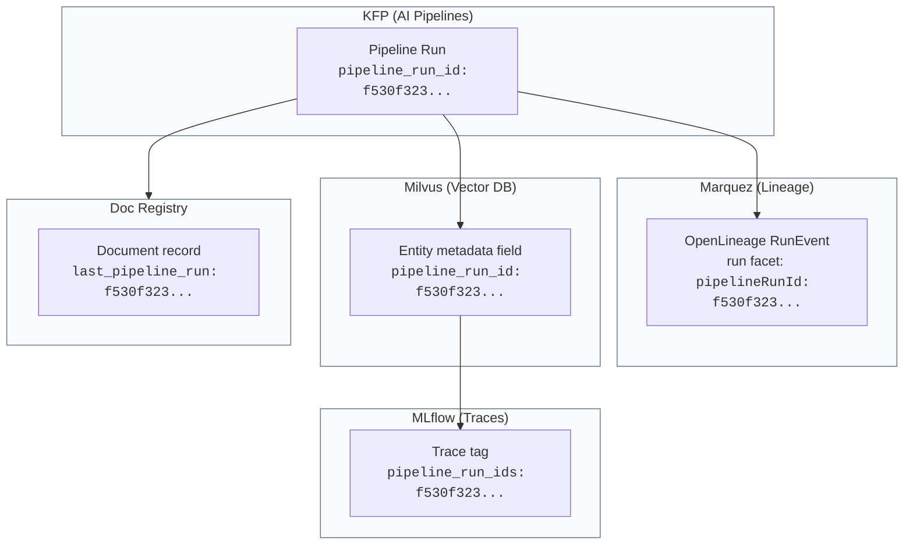

# Correlation: Tracing an Answer Back to a Document Section

## The Question

When the compliance review agent says:

> "Insurers shall not use external consumer data or AI systems in underwriting unless they can demonstrate through a comprehensive assessment that the guidelines are not unfairly discriminatory" **[ug-001]**

How do we trace that claim all the way back to page 3, Section 2 of the original NY DFS Circular Letter?

---

## The Correlation Key: `pipeline_run_id`

A single UUID — the `pipeline_run_id` — is the thread that ties everything together across all systems:

```
pipeline_run_id = "f530f323-142d-4c67-8dd1-3cc6ed43769d"
```

This ID is generated once when a pipeline run is submitted, and then **injected into every system** the data passes through:



---

## What Each System Stores

### 1. KFP — the pipeline run itself

The orchestrator. It records:
- Which pipeline version was executed
- All parameters (collection, embedding model, chunk size, etc.)
- Step-by-step status and timing
- The `pipeline_run_id` as a runtime parameter

### 2. Milvus — every chunk carries its provenance

When chunks are inserted into Milvus, each entity stores:

| Field | Value | Purpose |
|---|---|---|
| `pipeline_run_id` | `f530f323...` | Which pipeline run created this chunk |
| `doc_id` | `ug-001` | Which source document this came from |
| `chunk_index` | `7` | Position within the document |
| `section_path` | `Section 2 > Requirements > Non-Discrimination` | Where in the document |
| `page_numbers` | `3` | Original page in the source PDF/DOCX |
| `text` | The actual chunk content | What the LLM sees |

This is what makes document-section-level traceability possible. The metadata travels with the vector.

### 3. MLflow — the trace captures what was retrieved

When a query runs, the MLflow trace is enriched with tags:

| Tag | Value | Purpose |
|---|---|---|
| `pipeline_run_ids` | `f530f323...,31fa8595...` | Which pipeline runs produced the retrieved chunks |
| `doc_ids_cited` | `ug-001,rb-002,rb-003` | Which documents were cited in the answer |
| `collection_queried` | `underwriting_guidelines,regulatory_bulletins` | Which collections were searched |
| `chunks_detail` | JSON array of chunk metadata | Full provenance per chunk (doc_id, score, section_path, page_numbers) |

### 4. Marquez — the lineage graph

OpenLineage events connect the processing chain:
- `acquire_documents/underwriting_guidelines` consumed document `ug-001` and produced S3 staging
- `parse_and_chunk/underwriting_guidelines` consumed S3 staging and produced S3 chunks
- `ingest_to_milvus/underwriting_guidelines` consumed S3 chunks and produced the Milvus collection
- `compliance_review_agent` consumed the Milvus collection

Each event carries the `pipelineRunId` as a run facet.

### 5. Doc Registry — federated provenance API

The registry ties it all together. It stores document identity and provides the federation layer that queries both Marquez and MLflow to build the full picture.

---

## The Full Trace: Answer → Document Section

Starting from an answer the agent gave:

```
Step 1: MLflow Trace
  ├── trace tag: doc_ids_cited = "ug-001"
  ├── trace tag: pipeline_run_ids = "f530f323..."
  └── chunks_detail[3]:
        doc_id: "ug-001"
        chunk_index: 7
        section_path: "Section 2 > Requirements > Non-Discrimination"
        page_numbers: "3"
        pipeline_run_id: "f530f323..."

Step 2: Milvus Entity
  ├── Confirms the chunk exists with that pipeline_run_id
  ├── Full text of the chunk available
  └── section_path + page_numbers → exact location in source

Step 3: Doc Registry
  ├── doc_id "ug-001" →
  │     name: "NY DFS guidance on use of AI systems..."
  │     source_url: s3://rag-chunks/corpus/underwriting_guidelines/ny-dfs-cl2024-07-ai-underwriting.docx
  └── last_pipeline_run: "f530f323..."

Step 4: Marquez Lineage
  ├── Job: acquire_documents/underwriting_guidelines
  │     run with pipelineRunId facet = "f530f323..."
  │     input: registry://s3/ug-001
  │     output: s3://staging/underwriting_guidelines
  ├── Job: parse_and_chunk/underwriting_guidelines
  │     input: s3://staging/underwriting_guidelines
  │     output: s3://chunks/underwriting_guidelines
  └── Job: ingest_to_milvus/underwriting_guidelines
        input: s3://chunks/underwriting_guidelines
        output: milvus://underwriting_guidelines

Step 5: Source Document
  └── s3://rag-chunks/corpus/underwriting_guidelines/ny-dfs-cl2024-07-ai-underwriting.docx
      Page 3, Section 2: "Requirements > Non-Discrimination"
```

---

## Why This Matters for Insurance

Regulators (NY DFS, state DOIs, NAIC) require that any AI-assisted underwriting decision be **auditable**. An auditor asking "where did this guidance come from?" needs to follow the chain:

1. **What answer was given?** → MLflow trace (question, answer, timestamp, user)
2. **What documents were consulted?** → MLflow trace tags (doc_ids_cited, collection_queried)
3. **What specific sections were retrieved?** → chunks_detail (section_path, page_numbers, text_preview)
4. **How were those chunks created?** → pipeline_run_id → Marquez lineage (processing steps, parameters)
5. **Where is the original document?** → Doc Registry → source_url (S3 path to the original file)

No system holds the full picture alone. The `pipeline_run_id` is what lets you join across KFP, Milvus, MLflow, Marquez, and the Registry.

---

## The Registry Provenance API: One Call, Full Picture

```
GET /api/v1/provenance/document/ug-001
```

Returns:
```json
{
  "doc_id": "ug-001",
  "name": "NY DFS guidance on use of AI systems...",
  "source_url": "s3://rag-chunks/corpus/underwriting_guidelines/ny-dfs-cl2024-07-ai-underwriting.docx",
  "collections": ["underwriting_guidelines"],
  "pipeline_run_ids": ["f530f323-142d-4c67-8dd1-3cc6ed43769d"],
  "marquez_links": [
    {
      "job_name": "acquire_documents/underwriting_guidelines",
      "run_id": "...",
      "url": "https://marquez-web-.../lineage/job/..."
    }
  ],
  "recent_query_traces": [
    {
      "trace_id": "tr-a5d83754...",
      "question": "Compare our underwriting guidelines against...",
      "collection": "iso_forms,underwriting_guidelines",
      "doc_ids_cited": ["ug-001", "if-001", "if-002"],
      "chunks": [
        {
          "doc_id": "ug-001",
          "chunk_index": 7,
          "section_path": "Section 2 > Requirements > Non-Discrimination",
          "page_numbers": "3"
        }
      ]
    }
  ]
}
```

This single API call federates data from the Registry database, Marquez, and MLflow to give you the complete provenance picture — both **forward** (where did this document end up?) and **backward** (which queries used it?).
