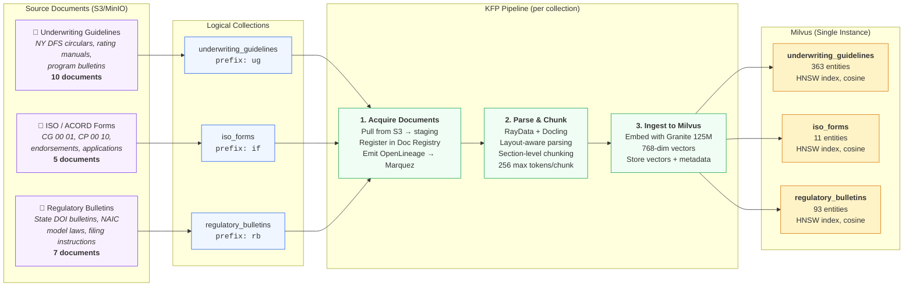

# RAG Ingest Pipeline: Documents → Collections → Vector DB

## Pipeline Flow



## Key Points

- **One Milvus instance**, three collections — not three separate databases
- **One pipeline definition**, run three times (once per collection) with different parameters
- Each collection has its own schema, lifecycle, and doc ID prefix
- The agent later performs **multi-hop retrieval** by searching across collections independently and cross-referencing results

## Entity Per Collection

| Collection | Documents | Chunks (Entities) | Doc ID Prefix |
|---|---|---|---|
| `underwriting_guidelines` | 10 | 363 | `ug-` |
| `iso_forms` | 5 | 11 | `if-` |
| `regulatory_bulletins` | 7 | 93 | `rb-` |

## Each Entity Stores

```
┌─────────────────────────────────────────────────┐
│ Milvus Entity (one per chunk)                   │
├─────────────────────────────────────────────────┤
│ embedding        float[768]  ← Granite 125M    │
│ text             varchar     ← raw chunk text   │
│ doc_id           varchar     ← e.g. "ug-001"   │
│ pipeline_run_id  varchar     ← provenance link  │
│ chunk_index      int         ← position in doc  │
│ section_path     varchar     ← heading hierarchy│
│ page_numbers     varchar     ← source pages     │
│ category         varchar     ← document category│
│ subcategory      varchar     ← sub-classification│
└─────────────────────────────────────────────────┘
```
