# Pipeline Datasets: What Each Step Produces

## The Three Datasets Between Pipeline Steps

```mermaid
flowchart LR
    subgraph step1["Step 1: Acquire Documents"]
        acquire["Pull from source<br/>Register in Doc Registry<br/>Assign doc_ids"]
    end

    subgraph ds1["Dataset: S3 Staging"]
        staging["Raw documents (PDF, DOCX)<br/>+ manifest.json<br/><br/><i>s3://minio/rag-chunks/staging/underwriting_guidelines/</i>"]
    end

    subgraph step2["Step 2: Parse & Chunk"]
        parse["Docling layout-aware parsing<br/>Section-level splitting<br/>256 max tokens per chunk"]
    end

    subgraph ds2["Dataset: S3 Chunks"]
        chunks["JSON files (one per document)<br/>Array of text chunks + metadata<br/><br/><i>s3://minio/rag-chunks/chunks/underwriting_guidelines/</i>"]
    end

    subgraph step3["Step 3: Ingest to Milvus"]
        ingest["Embed with Granite 125M<br/>Store vectors + text + metadata"]
    end

    subgraph ds3["Dataset: Milvus Collection"]
        milvus["768-dim vectors + raw text<br/>+ all metadata per chunk<br/><br/><i>milvus://milvus:19530/underwriting_guidelines</i>"]
    end

    step1 --> ds1 --> step2 --> ds2 --> step3 --> ds3
```



---

## Dataset 1: S3 Staging Area

**What it is:** A folder in MinIO containing the raw source documents exactly as they were in the source system.

**Contents:**
- The original files (PDF, DOCX) — unchanged
- A `manifest.json` listing what was fetched, with metadata per document

**Example manifest entry:**
```json
{
  "doc_id": "ug-001",
  "source_url": "s3://rag-chunks/corpus/underwriting_guidelines/ny-dfs-cl2024-07-ai-underwriting.docx",
  "source_system": "s3",
  "document_type": "circular_letter",
  "line_of_business": "all",
  "jurisdiction": "NY"
}
```

**Purpose:** Decouple sourcing from processing. If parsing fails, you retry from staging without re-fetching. The manifest provides the contract between acquire and parse steps.

---

## Dataset 2: S3 Chunks (JSON)

**What it is:** A folder in MinIO containing JSON files — one per source document — each holding an array of text chunks.

**File format:** Plain JSON. No embeddings yet.

**Example (one file, `ug-001.json`):**
```json
{
  "doc_id": "ug-001",
  "pipeline_run_id": "f530f323-142d-4c67-8dd1-3cc6ed43769d",
  "total_chunks": 45,
  "chunks": [
    {
      "chunk_index": 0,
      "text": "The New York Department of Financial Services expects insurers to establish governance frameworks for AI systems used in underwriting...",
      "section_path": "Section 1 > Scope and Applicability",
      "page_numbers": "1-2",
      "token_count": 203
    },
    {
      "chunk_index": 1,
      "text": "Insurers shall not use external consumer data or AI systems in underwriting unless they can demonstrate...",
      "section_path": "Section 2 > Requirements > Non-Discrimination",
      "page_numbers": "3",
      "token_count": 187
    }
  ]
}
```

**What Docling did:**
- Detected layout (headers, paragraphs, tables, multi-column)
- Preserved document structure as `section_path`
- Split at semantic boundaries (section breaks, not arbitrary character limits)
- Kept tables intact as single chunks
- Recorded source page numbers

---

## Dataset 3: Milvus Collection

**What it is:** A vector database collection containing one entity (row) per chunk. Each entity has both the **embedding** (for search) and the **payload** (for retrieval display).

**What's stored per entity:**

| Field | Type | Purpose |
|---|---|---|
| `embedding` | float[768] | Granite 125M vector — used for ANN similarity search |
| `text` | varchar | Raw chunk text — returned to the LLM as context |
| `doc_id` | varchar | e.g., "ug-001" — for citation and provenance |
| `pipeline_run_id` | varchar | Links back to the KFP run that created it |
| `chunk_index` | int | Position within the source document |
| `section_path` | varchar | Heading hierarchy from Docling |
| `page_numbers` | varchar | Source pages in original document |
| `category` | varchar | Document classification |
| `subcategory` | varchar | Sub-classification |

**It's not just embeddings.** The collection is the complete queryable knowledge store — the vector is the index, everything else is the payload returned at query time. When the MCP server searches, it returns `text`, `doc_id`, `section_path`, etc. alongside the similarity score.

---

## In Marquez

Each dataset appears as a node in the lineage graph. Marquez connects them because:
- Step 1's **output** (S3 staging) matches Step 2's **input**
- Step 2's **output** (S3 chunks) matches Step 3's **input**
- Step 3's **output** (Milvus collection) matches the apps' **input**

The dataset URIs (namespace + name) are the join keys that stitch the graph together.
