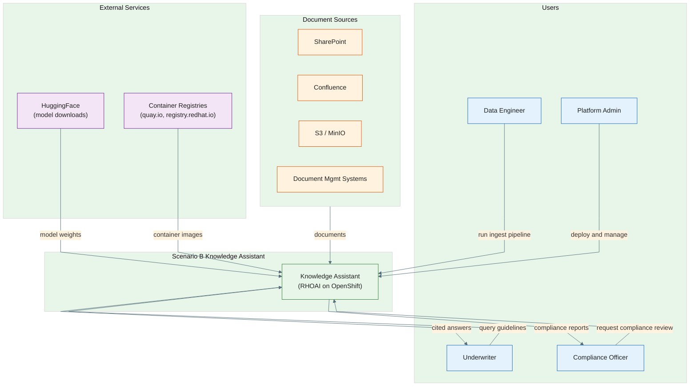
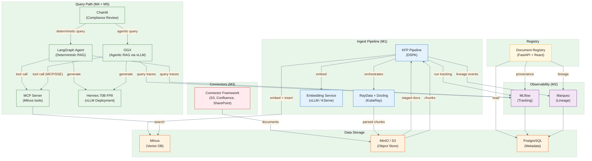

# Architecture Overview

High-level architecture for the Scenario B P&C Underwriting Knowledge Assistant on RHOAI.

**Last Updated:** 2026-05-28 (M5 complete)

## System Context (C4 Level 1)

What the system is, who uses it, and what external systems it interacts with.



**Reading guide:**
- Green = the system boundary (what we're building)
- Blue = user personas (see `docs/user-experience/personas.md`)
- Orange = document sources (connectors, M3)
- Purple = external dependencies

## Container View (C4 Level 2)

Deployable units within the system and how they interact.



**Reading guide:**
- Blue = ingest pipeline components (M1)
- Orange = storage layer
- Green = query path components (M4 + M5)
- Yellow/Amber = registry
- Purple = observability (M2)
- Red = connectors (M3)
- Data flows left-to-right for ingest, top-to-bottom for query

## Component Inventory

| Component | Technology | Milestone | Deployment | Purpose |
|-----------|-----------|-----------|------------|---------|
| KFP Pipeline | Kubeflow Pipelines v2 | M1 | DSPA (RHOAI) | Orchestrates ingest workflow |
| RayData + Docling | Ray 2.x, Docling | M1 | RayJob (KubeRay) | Distributed PDF parsing and chunking |
| Embedding Service | vLLM, Granite Embedding | M1 | KServe InferenceService | Vector embedding generation |
| Milvus | Milvus 2.4+ | M1 | Helm (Certified Partner) | Vector storage and similarity search |
| MinIO / S3 | MinIO | M1 | Deployment | Object storage for documents and artifacts |
| MLflow | MLflow 2.x | M2 | Deployment | Experiment tracking, query-time tracing |
| Marquez | Marquez 0.51+ | M2 | Deployment | OpenLineage backend, lineage graph |
| PostgreSQL | PostgreSQL 15+ | M2 | Deployment | Backend for MLflow and Marquez |
| Connector Framework | Python (pip package) | M3 | KFP component | Data source acquisition |
| OGX | OGX (RHOAI) | M5 | RHOAI managed | Agentic RAG via Responses API with server-side MCP tool execution |
| Hermes 70B FP8 | NousResearch/Hermes-3-Llama-3.1-70B-FP8, vLLM | M5 | Raw Kubernetes Deployment | LLM inference for answer generation (native tool calling) |
| Chainlit | Chainlit 1.x | M4 | Deployment | Chat-based UI for both deterministic and agentic RAG |
| LangGraph Agent | LangGraph, LangChain | M4 | Part of Chainlit pod | Deterministic RAG agent with fixed retrieve-then-generate graph |
| MCP Server | FastMCP (Python) | M4 | Deployment | Tool server exposing Milvus search via SSE for both LangGraph and OGX |
| Document Registry | FastAPI, PostgreSQL, React | M3 | Deployment | Document identity, collection management, provenance portal |

## Data Flow

### Ingest Path (M1 + M3)

```
Document Sources → [Connectors] → S3 Staging → [KFP] → RayData+Docling (parse/chunk)
    → S3 (JSONL chunks) → [KFP] → Embedding Service → Milvus (vectors + metadata)
```

Each vector in Milvus carries:
- `pipeline_run_id` — links to KFP run and lineage graph
- `source_document_id` — links to source document
- `chunk_text` — raw text for retrieval
- Standard metadata (LOB, doc type, effective date, etc.)

### Query Path (M4 + M5)

```
Workflow A (Deterministic RAG — M4):
User Query → Chainlit → LangGraph Agent → MCP Server → Milvus (single collection)
    → Hermes 70B FP8 (cited answer generation) → User

Workflow B (Agentic RAG — M5):
User Query → Chainlit → OGX Responses API → MCP Server (SSE) → Milvus (all 3 collections, multi-hop)
    → Hermes 70B FP8 (synthesized compliance review) → User
```

### Lineage Path (M2+)

```
Pipeline time: KFP steps → OpenLineage events → Marquez (pipeline lineage graph)
Query time: OGX queries → MLflow spans (with pipeline_run_id bridge) → MLflow
Auditor: MLflow trace → pipeline_run_id → Marquez graph → source documents
```

## Key Design Decisions

| Decision | ADR | Summary |
|----------|-----|---------|
| RayData + Docling pipeline design | ADR-001 | <!-- TODO: decided in M0/M1 --> |
| Chunking strategy and Milvus ingestion | ADR-002 | <!-- TODO: decided in M1 --> |
| OGX role (ingest vs query) | ADR-003 | <!-- TODO: decided in M0/M1 --> |
| Lineage architecture | ADR-004 | <!-- TODO: decided in M2 --> |
| Connector architecture | ADR-005 | <!-- TODO: decided in M3 --> |
| MLflow integration approach | ADR-006 | <!-- TODO: decided in M2 --> |
| Multi-repo strategy | ADR-007 | <!-- TODO: decided in M0 --> |

## Future Considerations

- **Multi-tenancy:** current design is single-namespace. Production would need namespace-per-tenant or Milvus partition-per-tenant with RBAC.
- **Hybrid search:** Milvus supports both dense and sparse vectors. Current design uses dense only. Hybrid search (BM25 + dense) improves recall for keyword-heavy queries.
- **Catalog integration:** OpenMetadata or Unity Catalog for dataset discovery. Deferred to post-M5 evaluation.
- **Lineage operator:** Kubernetes operator for Marquez lifecycle (CRD + Helm rendering, following MLflow operator pattern). Stretch goal.
- **Incremental processing:** Re-process only changed documents. Requires document version tracking and change detection.

## References

| Source | Link |
|--------|------|
| DataStrategy Scenario B | [scenario-b-underwriting-knowledge.md](https://github.com/abiazett/DataStrategy/blob/main/data-strategy-proposal/scenarios/scenario-b-underwriting-knowledge/scenario-b-underwriting-knowledge.md) |
| Five-pillar strategy | [RHAI-data-strategy-proposal.md](https://github.com/abiazett/DataStrategy/blob/main/data-strategy-proposal/RHAI-data-strategy-proposal.md) |
| v1 POC architecture | [data-strategy-poc/docs/architecture.md](https://github.com/briangallagher/data-strategy-poc/blob/main/docs/architecture.md) |
| Saad's pipeline components | [pipelines-components #53](https://github.com/opendatahub-io/pipelines-components/pull/53) |
| ET lineage demo | [lineage-demo-pipeline](https://github.com/rh-waterford-et/lineage-demo-pipeline) |
