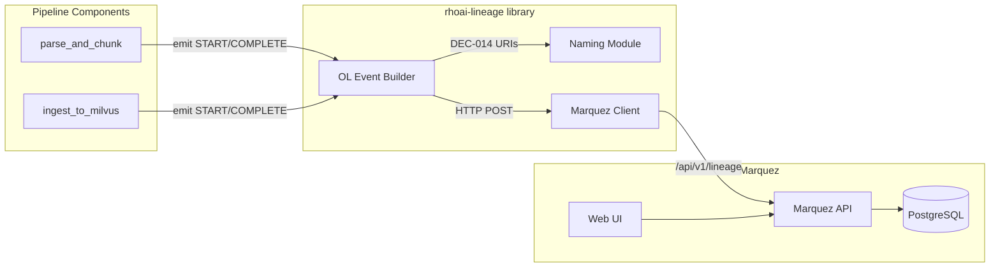
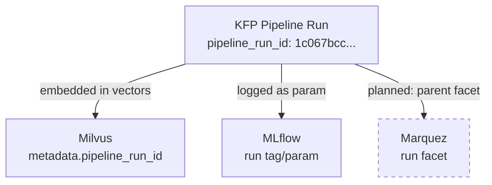

# Lineage Architecture

## What This Is

The lineage subsystem provides end-to-end data provenance for the ingest pipeline: given any vector in Milvus, you can trace it back through the processing chain to its source document. It uses OpenLineage as the protocol, Marquez as the backend, and the `rhoai-lineage` Python library to emit events from KFP pipeline components.

## Architecture Context

Lineage operates at two layers (only Layer 1 is implemented in M2):

1. **Pipeline-time lineage (M2):** Tracks data flow through KFP components — what datasets were consumed, what was produced, by which job, in which run. Stored in Marquez.
2. **Query-time tracing (M4/M5):** Tracks inference requests — which vectors were retrieved, which model generated the response, what prompt was used. Implemented via MLflow GenAI autolog (`mlflow.langchain.autolog()` for deterministic RAG, `mlflow.openai.autolog()` for agentic RAG). Traces include provenance tags (`doc_ids_cited`, `pipeline_run_ids`, `collection_queried`) that bridge back to Marquez lineage.
3. **Application lineage (M5):** Applications (`underwriter_chat`, `compliance_review_agent`) are registered in Marquez as consumers of Milvus collections via OpenLineage events, connecting the full graph from source docs to applications.



## How It Works

### OpenLineage Event Emission

Each pipeline component emits two OpenLineage events per run:

1. **START event** — emitted before processing begins, declaring input datasets
2. **COMPLETE event** — emitted after processing succeeds, declaring output datasets with facets

The `rhoai-lineage` library handles event construction, naming, and HTTP transport:

```python
from rhoai_lineage import LineageClient, naming

client = LineageClient()  # reads MARQUEZ_URL from env

client.emit_start(
    job_name=naming.job_name("parse_and_chunk"),
    namespace=naming.namespace(),  # from OPENLINEAGE_NAMESPACE
    inputs=[naming.pvc_dataset("data-pvc/input/pdfs")],
)

# ... do work ...

client.emit_complete(
    job_name=naming.job_name("parse_and_chunk"),
    namespace=naming.namespace(),
    inputs=[naming.pvc_dataset("data-pvc/input/pdfs")],
    outputs=[naming.s3_dataset("rag-chunks/chunks-m2")],
    facets={"custom_metrics": {...}},
)
```

### The Marquez Graph Structure

Marquez stores lineage as a directed acyclic graph with three node types:

| Node Type | What It Represents | Example |
|-----------|-------------------|---------|
| **Dataset** | A data asset (input or output) | `s3://minio-service...:9000/rag-chunks/chunks-m2` |
| **Job** | A processing step | `data-strat-poc/parse_and_chunk` |
| **Run** | A specific execution of a job | `99029c77-0bdc-4049-8725-f53c1d145662` |

The M2 graph has **5 nodes** and **4 edges**:

```
PVC (input/pdfs) → parse_and_chunk → S3 (rag-chunks/chunks-m2) → ingest_to_milvus → Milvus (underwriting_guidelines)
```

Each dataset has a namespace that encodes its storage system:
- `pvc://data-strat-poc` — PersistentVolumeClaim data
- `s3://minio-service.data-strat-poc.svc.cluster.local:9000` — S3/MinIO buckets
- `milvus://milvus.data-strat-poc.svc.cluster.local:19530` — Milvus collections

### Naming Conventions (DEC-014)

The `rhoai-lineage` naming module enforces consistent, cluster-resolvable identifiers:

| Entity | Pattern | Example |
|--------|---------|---------|
| Job namespace | Kubernetes namespace | `data-strat-poc` |
| Job name | Component function name | `parse_and_chunk` |
| S3 dataset namespace | `s3://<service>.<ns>.svc.cluster.local:<port>` | `s3://minio-service.data-strat-poc.svc.cluster.local:9000` |
| S3 dataset name | `<bucket>/<key>` | `rag-chunks/chunks-m2` |
| PVC dataset namespace | `pvc://<namespace>` | `pvc://data-strat-poc` |
| PVC dataset name | `<pvc>/<path>` | `data-pvc/input/pdfs` |
| Milvus dataset namespace | `milvus://<service>.<ns>.svc.cluster.local:<port>` | `milvus://milvus.data-strat-poc.svc.cluster.local:19530` |
| Milvus dataset name | Collection name | `underwriting_guidelines` |

### DSP Namespace Injection

The `OPENLINEAGE_NAMESPACE` environment variable is injected into all pipeline pods via the DSPA CR's downward API configuration:

```yaml
# In DSPA CR spec
apiServer:
  podAnnotations:
    fieldRef:metadata.namespace: OPENLINEAGE_NAMESPACE
```

This was implemented via `inject-openlineage-namespace.sh` which patches the DSPA to include the namespace from `metadata.namespace`. This ensures portability — if the namespace is renamed, lineage events automatically use the correct value.

### The pipeline_run_id Correlation Flow

The KFP `pipeline_run_id` is the cross-system correlation key:



**Current state:** `pipeline_run_id` is stored in Milvus vector metadata and passed to components. It is NOT yet emitted as a Marquez run facet (PG-025) — this means cross-referencing from Marquez back to KFP requires matching timestamps rather than a direct ID lookup.

### Bridge Feature Flag Design

The MLflow-Marquez bridge is controlled by `MLFLOW_BRIDGE_ENABLED` in the `data-strat-lineage-config` ConfigMap:

| Value | Behaviour |
|-------|-----------|
| `false` (default) | MLflow tracking URI points to MLflow server directly. Lineage via rhoai-lineage only. |
| `true` | MLflow tracking URI becomes `openlineage+https://marquez.../api/v1/lineage`. MLflow events also appear in Marquez. |

When the bridge is ON, MLflow experiment/run metadata creates additional Marquez nodes alongside the direct OL emission. This can be useful for correlating experiment metrics with data lineage but adds graph complexity.

### Configuration

All lineage configuration is centralised in a single ConfigMap:

```yaml
apiVersion: v1
kind: ConfigMap
metadata:
  name: data-strat-lineage-config
  namespace: data-strat-poc
data:
  MARQUEZ_URL: "http://marquez-api:5000"
  MLFLOW_BRIDGE_ENABLED: "false"
  MLFLOW_TRACKING_URI: "https://mlflow.redhat-ods-applications.svc:8443"
```

This ConfigMap is referenced in the DSPA CR via `configMapAsEnv`, making all values available to pipeline pods without per-component configuration.

### Dependencies

| Dependency | Version | Purpose |
|------------|---------|---------|
| rhoai-lineage | 0.1.0 (git) | OL event emission, naming, Marquez client |
| Marquez API | 0.49+ | OpenLineage backend |
| Marquez Web UI | 0.49+ | Lineage graph visualization |
| PostgreSQL | 14+ | Marquez metadata store |
| OpenLineage spec | 2.0.2 | Event schema standard |

## Design Decisions

- **ADR-004:** Lineage architecture — fork-and-adapt, bridge OFF, operator deferred
- **DEC-014:** Naming conventions enforced by library

## Known Limitations

| ID | Limitation | Impact |
|----|-----------|--------|
| PG-001 | No auth on Marquez API | Anyone with cluster network access can read/write lineage data |
| PG-013 | OL emission is manual (no auto-instrumentation) | Every component must explicitly call rhoai-lineage |
| PG-021 | rhoai-lineage installed via git URL | Slow pip install in KFP pods (~30s overhead) |
| PG-022 | Marquez in same namespace as pipeline | No network isolation; blast radius if Marquez PG fails |
| PG-023 | Lineage operator not deployed | No agent-level lineage; pod-watching deferred to M4/M5 |
| PG-025 | pipeline_run_id not in Marquez facets | Cannot correlate Marquez runs to KFP runs by ID (timestamp matching only) |

## Future Considerations

- **Query-time lineage:** Implemented in M4/M5 via MLflow autolog. Pipeline and query lineage are federated through the Document Registry provenance portal rather than the Marquez bridge.
- **Auto-instrumentation:** A KFP decorator or DSP webhook could auto-emit START/COMPLETE events, removing the need for explicit library calls in components.
- **Schema facets:** Future components should emit `SchemaDatasetFacet` with field-level metadata (column names, types) for richer lineage.
- **Column-level lineage:** Track which specific fields flow between datasets (e.g., `text` field in JSONL → `embedding` field in Milvus).

## References

| Source | Link |
|--------|------|
| ADR-004 | `docs/architecture/adrs/ADR-004-lineage-architecture.md` |
| rhoai-lineage repo | https://github.com/briangallagher/rhoai-lineage |
| OpenLineage spec | https://openlineage.io/spec/2-0-2/ |
| Marquez API docs | https://marquezproject.ai/docs/api-reference |
| Marquez Web UI (deployed) | https://marquez-web-data-strat-poc.apps.dev.aip-ft.rh-ods.com |
| Marquez API (deployed) | https://marquez-data-strat-poc.apps.dev.aip-ft.rh-ods.com |
| ConfigMap manifest | `manifests/marquez/lineage-config.yaml` |
