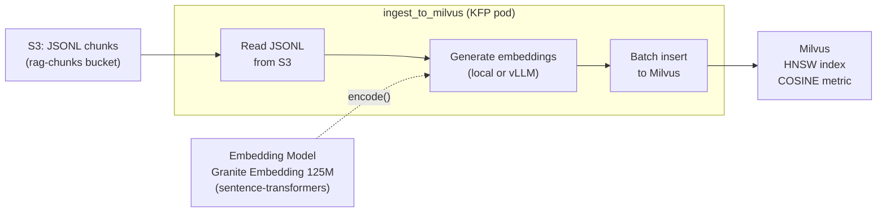
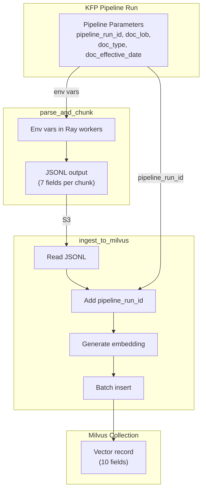

# Milvus Ingestion

## What This Is

The `ingest_to_milvus` component is a KFP pipeline step that reads chunked documents (JSONL) from S3, generates dense vector embeddings, and inserts them into a Milvus collection with full Scenario B metadata. It is the second step of the ingest pipeline's data chain, receiving output from `parse_and_chunk` and producing the queryable vector store.

## Architecture Context

This component sits between the chunking output in S3 and the Milvus vector database. It handles embedding generation, schema enforcement, and batch insertion.



**Boundary:** `ingest_to_milvus` owns embedding generation, Milvus collection management (create/drop), schema enforcement, and vector insertion. It does not parse documents or produce chunks — that is `parse_and_chunk`'s responsibility (see [raydata-docling.md](raydata-docling.md)).

## How It Works

### 1. S3 JSONL Retrieval

The component reads all JSONL files from the S3 output path produced by `parse_and_chunk`. Each line in each file represents one chunk:

```json
{
  "source_file": "ca-doi-bulletin-2024-7.pdf",
  "source_document_id": "ca-doi-bulletin-2024-7",
  "chunk_index": 0,
  "text": "The California Department of Insurance hereby issues...",
  "lob": "commercial_property",
  "doc_type": "regulatory_bulletin",
  "effective_date": "2024-07-01"
}
```

### 2. Embedding Generation

Two modes are supported, selectable per pipeline run:

**Local sentence-transformers (default for M1):**
- Downloads `ibm-granite/granite-embedding-125m-english` from HuggingFace at runtime (~500MB)
- Runs embedding in-pod on CPU
- Produces 768-dimensional dense vectors
- No external service dependency

**vLLM endpoint (target for production):**
- Calls a KServe InferenceService endpoint (`/v1/embeddings` API)
- Requires vLLM with `--task=embedding` support (RHOAI 3.5+; blocked on 3.4 — PG-018)
- GPU-accelerated, higher throughput for large corpora

M1 uses local mode exclusively because RHOAI 3.4's vLLM lacks embedding task support (PG-018).

### 3. Milvus Collection Management

Before insertion, the component ensures the target collection exists with the correct schema:

- **`drop_existing=true` (default):** Drops the collection if it exists, then recreates with the full schema. Ensures idempotency — re-running produces exactly the same result.
- **`drop_existing=false`:** Appends to the existing collection. Risks duplicates if the same documents are re-ingested (no deduplication — see Future Considerations).

### 4. Collection Schema

The Milvus collection has 10 fields as defined in ADR-002:

| Field | Type | Description |
|-------|------|-------------|
| `id` | INT64 (auto PK) | Auto-generated primary key |
| `source_file` | VARCHAR(512) | Original filename |
| `source_document_id` | VARCHAR(256) | Stable document identifier (filename stem, kebab-case) |
| `pipeline_run_id` | VARCHAR(64) | UUID linking to the KFP pipeline run — lineage bridge |
| `chunk_index` | INT64 | Position of chunk within the source document |
| `text` | VARCHAR(32768) | Raw chunk text |
| `lob` | VARCHAR(128) | Line of business |
| `doc_type` | VARCHAR(128) | Document type |
| `effective_date` | VARCHAR(32) | Document effective date (ISO 8601) |
| `embedding` | FLOAT_VECTOR(768) | Dense vector from Granite Embedding 125M |

### 5. HNSW Index

The collection uses an HNSW (Hierarchical Navigable Small World) index:

| Parameter | Value | Rationale |
|-----------|-------|-----------|
| `M` | 16 | Connections per node; balances recall vs memory |
| `efConstruction` | 256 | Build-time quality; higher = better index at cost of slower builds |
| `metric_type` | COSINE | Cosine similarity for normalised embeddings |

HNSW was chosen over the Ray team's default IVF_FLAT because it requires no training step, supports incremental inserts without degradation, and offers better recall at low latency for collections under 1M vectors. See ADR-002 for the full comparison.

### 6. Metadata Flow

The full metadata flow from pipeline parameters through to Milvus vectors:



Key detail: `pipeline_run_id` is added by `ingest_to_milvus`, not `parse_and_chunk`. The JSONL files carry 7 fields; the Milvus vector has 10 (adding `id` (auto), `pipeline_run_id`, and `embedding`).

### 7. Batch Processing

Vectors are inserted in batches to manage memory and handle large corpora:

- Default batch size depends on the embedding mode and available memory
- Local sentence-transformers processes all chunks from a single JSONL file, then inserts
- Each batch is a single `collection.insert()` call to Milvus

### Configuration

| Parameter | Default | Description |
|-----------|---------|-------------|
| `milvus_host` | `milvus.data-strat-poc.svc.cluster.local` | Milvus service endpoint |
| `milvus_port` | `19530` | Milvus gRPC port |
| `collection_name` | `rag_documents` | Target Milvus collection |
| `embedding_model` | `ibm-granite/granite-embedding-125m-english` | HuggingFace model ID |
| `embedding_dim` | `768` | Embedding vector dimension |
| `embedding_endpoint` | *(empty = local mode)* | vLLM `/v1/embeddings` URL; empty triggers local sentence-transformers |
| `drop_existing` | `true` | Drop and recreate collection before insert |
| `pipeline_run_id` | — | UUID for this pipeline run (set at pipeline level) |
| `s3_endpoint` | `http://minio-service:9000` | MinIO/S3 endpoint |
| `s3_access_key` / `s3_secret_key` | — | S3 credentials |
| `chunks_s3_path` | — | S3 path to JSONL files from `parse_and_chunk` |

### Dependencies

| Dependency | Version | Purpose |
|------------|---------|---------|
| pymilvus | 2.4+ | Milvus client library |
| sentence-transformers | latest | Local embedding generation (Granite 125M) |
| boto3 / s3fs | — | S3 access for JSONL retrieval |
| torch | — | Tensor operations for embeddings |
| Milvus (server) | 2.4+ | Vector storage with HNSW index |
| MinIO / S3 | — | JSONL chunk storage |

## Design Decisions

- **ADR-002:** Defines the full collection schema (10 fields), HNSW index parameters, metadata flow, and collection naming conventions. This component implements that design.
- **ADR-003:** Explains why embedding and Milvus writes are done directly (not via OGX Vector I/O) — better control, debuggability, and lineage observability.
- **Local embedding as M1 default:** vLLM on RHOAI 3.4 lacks `--task=embedding` support (PG-018). Local sentence-transformers works reliably and produces identical embeddings for consistency verification.
- **`drop_existing=true` default:** Ensures idempotency for M1 verification — re-running the pipeline on the same corpus produces exactly the same collection. Production should default to `false` with deduplication.

## Known Limitations

| Limitation | Detail | Gap ID |
|------------|--------|--------|
| Model downloaded every run | Local sentence-transformers downloads ~500MB from HuggingFace on each execution | PG-019 |
| No retry on Milvus writes | Basic try/except; no exponential backoff or dead-letter handling | PG-003 |
| No hybrid search vectors | Dense-only embeddings; no BM25 sparse vectors for keyword recall | PG-007 |
| No document-level RBAC | All vectors in a collection are accessible to anyone who can query | PG-008 |
| `drop_existing=true` default | Drops entire collection on every run; dangerous if pointing at a production collection | — |
| No chunk deduplication | With `drop_existing=false`, re-running duplicates all vectors | — |
| Single-threaded embedding | Local mode embeds sequentially in the KFP pod; no parallelism | — |
| RHOAI 3.4 vLLM lacks embedding task | Cannot use GPU-accelerated embedding service on current RHOAI version | PG-018 |

## Future Considerations

- **Embedding model caching (PG-019):** Mount the model on a PVC or use a shared model cache. Eliminates the ~500MB download on every run. Alternatively, deploy a dedicated embedding InferenceService when RHOAI supports `--task=embedding`.
- **Chunk deduplication:** Add `chunk_hash` (SHA-256 of text) to the schema. On insert, check for existing chunks with the same hash. Enables `drop_existing=false` without duplicates.
- **Retry with backoff (PG-003):** Implement configurable retry with exponential backoff on Milvus writes. Failed chunks written to a dead-letter JSONL in S3 for later retry.
- **Hybrid search (PG-007):** Add a sparse vector field (BM25) alongside the dense embedding. Requires generating both sparse and dense vectors at ingest time. Milvus 2.4+ supports multi-vector search.
- **Batch size tuning:** Make batch size a pipeline parameter. For local embedding, process chunks in configurable batches to manage pod memory. For vLLM endpoint, batch according to GPU memory.
- **Schema migration tooling:** Milvus doesn't support ALTER TABLE. Schema changes require drop + re-ingest. Consider a migration script that automates: create new collection → re-embed from S3 JSONL → swap alias.
- **Embedding model versioning:** Track which model version produced each embedding. If the model changes, all vectors need re-embedding. The `pipeline_run_id` partially tracks this (all vectors from a run used the same model), but an explicit `embedding_model` field would be more robust.
- **OpenLineage emission (M2):** This component is a prime candidate for OpenLineage events — it transforms S3 datasets into Milvus datasets. The rhoai-lineage library (M2) will wrap the embed+insert logic with OL emission.

## References

| Source | Link |
|--------|------|
| ADR-002 (schema + chunking design) | [ADR-002-chunking-milvus-schema.md](../architecture/adrs/ADR-002-chunking-milvus-schema.md) |
| ADR-003 (OGX role — why direct writes) | [ADR-003-ogx-role.md](../architecture/adrs/ADR-003-ogx-role.md) |
| the Ray team's ingest component (baseline) | [pipelines-components #53](https://github.com/opendatahub-io/pipelines-components/pull/53) |
| Fork branch (with fixes) | [briangallagher/pipelines-components:data-strat-poc](https://github.com/briangallagher/pipelines-components/tree/data-strat-poc) |
| Milvus HNSW index docs | [milvus.io/docs/index.md](https://milvus.io/docs/index.md) |
| RayData + Docling (previous step) | [raydata-docling.md](raydata-docling.md) |
| Production gaps register | [production-gaps.md](../production-gaps.md) |
