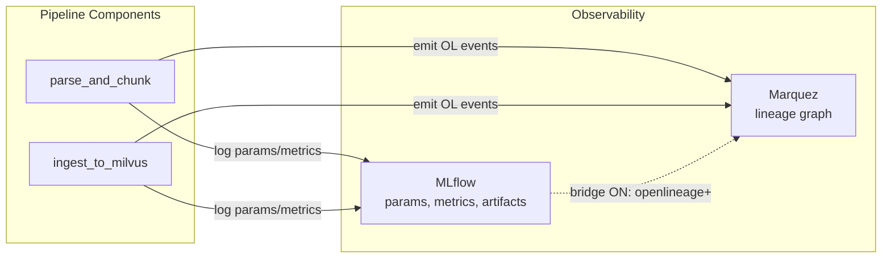

# MLflow Integration

## What This Is

MLflow provides experiment tracking for the ingest pipeline — recording parameters, metrics, and artifacts for each pipeline run. In this project, MLflow is deployed via the RHOAI MLflow Operator (cluster-wide instance with per-namespace workspaces) and is used alongside Marquez (not as a replacement) for observability.

## Architecture Context

MLflow sits alongside Marquez as a complementary observability system:

- **MLflow:** Tracks *what happened* in a run — parameters used, metrics produced, model artifacts
- **Marquez:** Tracks *data flow* — which datasets were consumed and produced, by which jobs



## How It Works

### RHOAI MLflow Operator

The MLflow Operator deploys a cluster-wide MLflow instance managed by RHOAI:

| Aspect | Detail |
|--------|--------|
| Operator | `opendatahub-io/mlflow-operator` (installed via RHOAI DSC) |
| Deployment | Cluster-wide in `redhat-ods-applications` namespace |
| Multi-tenancy | Per-namespace workspaces via `X-Mlflow-Workspace` header |
| Auth | SA token + `Authorization: Bearer` header |
| Internal endpoint | `https://mlflow.redhat-ods-applications.svc:8443` |
| External endpoint | `https://mlflow-ui-redhat-ods-applications.apps.dev.aip-ft.rh-ods.com` |

### Pipeline Component Logging

Pipeline components log to MLflow using the standard `mlflow` Python client. Parameters and metrics tracked:

**parse_and_chunk:**
| Type | Key | Example Value |
|------|-----|---------------|
| param | `corpus_path` | `/mnt/data/input/pdfs` |
| param | `chunk_max_tokens` | `256` |
| param | `tokenizer` | `ibm-granite/granite-embedding-125m-english` |
| param | `num_workers` | `2` |
| param | `pipeline_run_id` | `1c067bcc-8dd9-41ab-a264-58a7e4f2d39c` |
| metric | `num_files_processed` | `11` |
| metric | `total_chunks_created` | `312` |
| metric | `duration_seconds` | `240.36` |

**ingest_to_milvus:**
| Type | Key | Example Value |
|------|-----|---------------|
| param | `collection_name` | `underwriting_guidelines` |
| param | `embedding_model` | `ibm-granite/granite-embedding-125m-english` |
| param | `embedding_dim` | `768` |
| param | `index_type` | `HNSW` |
| param | `pipeline_run_id` | `1c067bcc-8dd9-41ab-a264-58a7e4f2d39c` |
| metric | `vectors_inserted` | `312` |
| metric | `duration_seconds` | `29.17` |

### SA Token Auth for In-Cluster Access

KFP pods accessing the RHOAI MLflow instance need:

1. **ServiceAccount token** mounted at `/var/run/secrets/kubernetes.io/serviceaccount/token`
2. **Authorization header:** `Bearer <sa-token>`
3. **Workspace header:** `X-Mlflow-Workspace: data-strat-poc`

```python
import mlflow
import os

token = open("/var/run/secrets/kubernetes.io/serviceaccount/token").read()
os.environ["MLFLOW_TRACKING_TOKEN"] = token
os.environ["MLFLOW_TRACKING_URI"] = "https://mlflow.redhat-ods-applications.svc:8443"

mlflow.set_experiment("data-strat-poc/ingest")
with mlflow.start_run():
    mlflow.log_param("corpus_size", num_files)
    mlflow.log_metric("chunks_created", chunk_count)
```

**Current limitation (PG-024):** The standard `mlflow` client doesn't natively support the `X-Mlflow-Workspace` header required by the RHOAI operator. This requires either a custom request hook or environment variable configuration that hasn't been validated in KFP pods. M2 verification confirmed that MLflow tracking from pipeline pods does not work without this configuration.

### Bridge Mode

When `MLFLOW_BRIDGE_ENABLED=true`, the MLflow tracking URI is set to:

```
openlineage+https://marquez-data-strat-poc.apps.dev.aip-ft.rh-ods.com/api/v1/lineage
```

This causes the `mlflow` client to emit OpenLineage events to Marquez for every experiment/run operation. The result is that MLflow experiment metadata appears as additional nodes in the Marquez graph.

| Bridge State | MLflow Tracking URI | Marquez Impact |
|-------------|--------------------| --------------|
| OFF (default) | `https://mlflow.redhat-ods-applications.svc:8443` | Only rhoai-lineage OL events |
| ON | `openlineage+https://marquez.../api/v1/lineage` | MLflow events + rhoai-lineage events |

**Trade-off:** Bridge ON provides a unified view but creates synthetic nodes in Marquez that may not map cleanly to the physical data flow. Bridge OFF keeps the graph clean and predictable.

### Configuration

| Environment Variable | Source | Value |
|---------------------|--------|-------|
| `MLFLOW_TRACKING_URI` | `data-strat-lineage-config` ConfigMap | `https://mlflow.redhat-ods-applications.svc:8443` |
| `MLFLOW_BRIDGE_ENABLED` | `data-strat-lineage-config` ConfigMap | `false` |
| `MLFLOW_TRACKING_TOKEN` | SA token (pod mount) | Auto from `/var/run/secrets/...` |

### Dependencies

| Dependency | Version | Purpose |
|------------|---------|---------|
| MLflow (server) | Managed by RHOAI Operator | Experiment tracking backend |
| `mlflow` (Python) | 2.x | Client library in pipeline components |
| MLflow Operator | Part of RHOAI 3.4+ DSC | Deploys and manages MLflow |

## Design Decisions

- **ADR-004:** MLflow and Marquez are independent systems, correlated by `pipeline_run_id`
- **Bridge OFF by default:** Direct OL emission is cleaner for pipeline-time lineage

## Known Limitations

| ID | Limitation | Impact |
|----|-----------|--------|
| PG-002 | MLflow auth relies on RHOAI operator patterns | External access requires kube-auth-proxy |
| PG-024 | MLflow tracking may not work from KFP pods | SA token + workspace header combination unvalidated in DSP environment |

## Future Considerations

- **Query-time GenAI traces (M4):** MLflow's `mlflow.tracing` API will capture inference spans — prompt, retrieval, generation — with structured metadata. This is where MLflow becomes essential (Marquez doesn't handle request-level tracing).
- **Model registry integration:** MLflow model registry could track fine-tuned models alongside experiment runs, providing a full lineage from training data → model → deployed endpoint.
- **Custom request hooks:** Implement `mlflow.set_http_request_hook()` to inject `X-Mlflow-Workspace` header, enabling transparent RHOAI operator auth from any MLflow client call.
- **Artifact logging:** Log chunked JSONL files or embedding samples as MLflow artifacts for debugging and reproducibility.

## References

| Source | Link |
|--------|------|
| ADR-004 | `docs/architecture/adrs/ADR-004-lineage-architecture.md` |
| RHOAI MLflow overview | `knowledge/rhoai/mlflow/mlflow.md` |
| MLflow technical architecture | `knowledge/rhoai/mlflow/technical-architecture.md` |
| MLflow Operator | https://github.com/opendatahub-io/mlflow-operator |
| MLflow Python client | https://mlflow.org/docs/latest/python_api/ |
| ConfigMap manifest | `manifests/marquez/lineage-config.yaml` |
