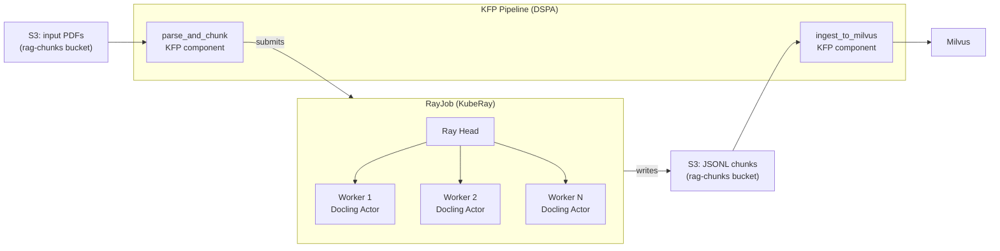

# RayData + Docling Processing Pipeline

## What This Is

The `parse_and_chunk` component is a KFP pipeline step that parses PDF documents into structured, semantically chunked text using RayData for distributed compute and IBM Docling for document understanding. It is the first step in the ingest pipeline — converting raw PDFs into JSONL chunks stored in S3, ready for embedding and Milvus insertion. This component originated from Saad Zaher's merged PR #53 to `opendatahub-io/pipelines-components` and was adapted for Scenario B metadata requirements.

## Architecture Context

The processing pipeline fits into the broader ingest flow between document storage (S3/MinIO) and the embedding+storage step (`ingest_to_milvus`). KFP orchestrates the execution; Ray handles distributed document processing within a single pipeline step.



**Boundary:** `parse_and_chunk` owns PDF parsing, chunking, metadata attachment, and JSONL output. It does not perform embedding or vector storage — that is `ingest_to_milvus`'s responsibility (see [milvus-ingestion.md](milvus-ingestion.md)).

## How It Works

### 1. KFP Component Submission

The `parse_and_chunk` KFP component (`@dsl.component`) runs as a pod in the `data-strat-poc` namespace. It:

1. Reads pipeline parameters (S3 paths, Ray config, document metadata)
2. Constructs a RayJob custom resource (CR) with the processing script and configuration
3. Submits the RayJob to the KubeRay operator via the K8s API
4. Polls the RayJob status until completion or timeout

**SA Token Auth Fix (PG-014):** KFP v2 on RHOAI strips `KUBERNETES_SERVICE_HOST` from user containers, breaking `load_incluster_config()`. The component manually loads the SA token from `/var/run/secrets/kubernetes.io/serviceaccount/token`, constructs an explicit `ApiClient`, and calls `CustomObjectsApi.create_namespaced_custom_object()` directly — bypassing `codeflare_sdk.RayJob.submit()` which uses its own broken client path.

### 2. RayJob Execution

The RayJob creates a Ray cluster (head + workers) and runs the processing script:

1. **Ray head** coordinates the actors and data pipeline
2. **Docling actors** are created as a pool (`ActorPoolStrategy`) — each actor loads the Docling model and processes documents independently
3. **RayData** reads input files from S3 and distributes work across the actor pool

### 3. Docling Document Processing

Each Docling actor:

1. **Parses the PDF** using Docling's `DocumentConverter` — extracts text, tables, headers, sections, and structural elements
2. **Preserves document structure** — Docling uses layout detection (97.9% table accuracy per DataStrategy research) to identify structural boundaries
3. **Chunks with HybridChunker** — splits the parsed document into semantically coherent chunks that respect structural boundaries (sections, paragraphs, tables)

### 4. HybridChunker

Docling's `HybridChunker` is structure-aware:

- Respects document element boundaries (won't split mid-table or mid-paragraph)
- Uses a tokenizer aligned with the embedding model (`ibm-granite/granite-embedding-125m-english`)
- `max_tokens=256` per chunk (configurable via pipeline parameter)
- Falls back to character-level splitting for elements that exceed `max_tokens`
- Does not apply overlap between chunks (a future optimisation target)

### 5. JSONL Output to S3

Each source document produces a JSONL file in S3 at `s3://rag-chunks/<run-specific-path>/`. Each line is a JSON object:

```json
{
  "source_file": "ca-doi-bulletin-2024-7.pdf",
  "source_document_id": "ca-doi-bulletin-2024-7",
  "chunk_index": 0,
  "text": "The California Department of Insurance hereby issues...",
  "lob": "commercial_property",
  "doc_type": "regulatory_bulletin",
  "effective_date": "2024-07-01"
}
```

Metadata fields (`lob`, `doc_type`, `effective_date`) come from pipeline parameters, passed as environment variables to the Ray workers. `source_document_id` is derived from the filename (stem, lowercase, kebab-case). See ADR-002 for the full schema rationale. PG-020 tracks the limitation that all documents in a run share the same metadata values.

### Configuration

| Parameter | Default | Description |
|-----------|---------|-------------|
| `namespace` | `data-strat-poc` | OpenShift namespace for RayJob |
| `input_s3_path` | — | S3 path to input PDFs |
| `output_s3_path` | — | S3 path for JSONL output |
| `s3_endpoint` | `http://minio-service:9000` | MinIO/S3 endpoint |
| `s3_access_key` / `s3_secret_key` | — | S3 credentials |
| `max_tokens` | `256` | HybridChunker max tokens per chunk |
| `ray_image` | `quay.io/rhoai-szaher/docling-ray:latest` | Docling + Ray worker image |
| `num_actors` | `2` | Docling actor pool size |
| `ray_worker_cpu` | `4` | CPU per Ray worker |
| `ray_worker_memory` | `8Gi` | Memory per Ray worker |
| `ray_head_cpu` | `2` | CPU for Ray head |
| `ray_head_memory` | `8Gi` | Memory for Ray head |
| `job_timeout` | `14400` | RayJob timeout in seconds (4 hours) |
| `doc_lob` | — | Line of business for all docs in this run |
| `doc_type` | — | Document type for all docs in this run |
| `doc_effective_date` | — | Effective date for all docs in this run |
| `bypass_kueue` | `true` | Skip Kueue scheduling (direct scheduling) |

### Dependencies

| Dependency | Version | Purpose |
|------------|---------|---------|
| KubeRay operator | 1.1+ | Manages Ray cluster lifecycle via RayJob CRs |
| Docling | bundled in ray image | PDF parsing and document understanding |
| docling-core (HybridChunker) | bundled in ray image | Structure-aware chunking |
| Ray | 2.x | Distributed compute (ActorPoolStrategy) |
| codeflare-sdk | 0.x | RayJob CR construction (submission bypassed — see PG-014) |
| MinIO / S3 | — | Input PDFs and output JSONL storage |
| kubernetes Python client | 29+ | Direct K8s API calls for RayJob submission |
| `quay.io/rhoai-szaher/docling-ray:latest` | — | Pre-built image with Docling + Ray + dependencies (~3GB) |

## Design Decisions

- **ADR-002:** Defines the JSONL schema, metadata fields, and how `parse_and_chunk` feeds into `ingest_to_milvus`. HybridChunker settings and tokenizer choice documented there.
- **ADR-003:** Explains why OGX is not used for ingest — direct Milvus writes via separate parse and ingest steps give better control, debuggability, and lineage observability.
- **SA token bypass:** The `codeflare_sdk.RayJob.submit()` path was bypassed because it creates its own K8s client internally, ignoring explicit configuration. The fix builds the RayJob CR via `job._build_rayjob_cr()` and submits it directly via `CustomObjectsApi`. This is a workaround, not a permanent fix.

## Known Limitations

| Limitation | Detail | Gap ID |
|------------|--------|--------|
| K8s API auth requires manual SA token loading | RHOAI strips `KUBERNETES_SERVICE_HOST`; `load_incluster_config()` fails | PG-014 |
| No incremental processing | Re-runs process all documents, not just changed ones | PG-006 |
| Pipeline-level metadata only | All docs in a run get same LOB/doc_type/effective_date | PG-020 |
| Image size | `docling-ray:latest` is ~3GB; first pull takes ~1 minute on cold nodes | — |
| No chunk overlap | HybridChunker does not apply overlap between chunks; may miss context at boundaries | — |
| No table-specific chunking | Tables are chunked the same as text; large tables may be split poorly | — |
| Timeout detection | 4-hour job timeout; no early detection of hung actors or OOM workers | — |

## Future Considerations

- **Per-document metadata from manifest (PG-020):** Replace pipeline-level env vars with a JSON manifest file in S3 keyed by filename. Each document gets its own metadata. Requires changes to the Ray worker script.
- **Incremental processing (PG-006):** Add document fingerprinting (SHA-256 of file content). Compare against previous run's fingerprints in S3 or Milvus metadata. Only process changed/new documents.
- **Chunk overlap:** Add configurable overlap (e.g., 50 tokens) between adjacent chunks to preserve context at boundaries. HybridChunker may support this in future Docling releases.
- **Table-specific chunking:** Tables extracted by Docling could be chunked differently (e.g., preserve full table or chunk by row groups). Depends on Docling's evolving table extraction capabilities.
- **GPU-accelerated parsing:** Docling supports GPU acceleration for layout detection. Currently using CPU-only workers. Evaluate GPU workers for large corpora (100+ documents).
- **Custom Docling image:** If `quay.io/rhoai-szaher/docling-ray:latest` becomes stale or needs customisation, build a custom image with CI in a dedicated repo. See ADR-007 (multi-repo strategy) for the component extraction assessment.
- **Upstream contribution:** If the SA token auth fix and metadata adaptations generalise, contribute back to `opendatahub-io/pipelines-components`.

## References

| Source | Link |
|--------|------|
| Saad's original PR | [pipelines-components #53](https://github.com/opendatahub-io/pipelines-components/pull/53) |
| Fork branch (with fixes) | [briangallagher/pipelines-components:data-strat-poc](https://github.com/briangallagher/pipelines-components/tree/data-strat-poc) |
| ADR-002 (chunking + Milvus schema) | [ADR-002-chunking-milvus-schema.md](../architecture/adrs/ADR-002-chunking-milvus-schema.md) |
| ADR-003 (OGX role — why not OGX for ingest) | [ADR-003-ogx-role.md](../architecture/adrs/ADR-003-ogx-role.md) |
| Phase 0 lessons learned | [m1-phase0-lessons-learned.md](../working/m1-phase0-lessons-learned.md) |
| Milvus ingestion (next step) | [milvus-ingestion.md](milvus-ingestion.md) |
| Production gaps register | [production-gaps.md](../production-gaps.md) |
